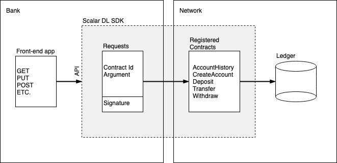

# A simple bank account application

## Overview

This is a simple bank account application. The actions that a user can performed are: create an account, view an account history, deposit funds to an account, withdraw funds from an account, and transfer funds between accounts. All actions performed on an account are recorded in Scalar DL, which means that the account history is recorded in a tamper-evident way, similar to how blockchains record blocks. This means that if an account history was altered (either intentionally or not), it is possible to detect this.  
 
To keep things simple here we are assuming that the bank holds the private key to execute all the contracts (see below for more explanation of how this works). This is probably not how you would want to use this bank application in practice. In this case a malicious account manager could actually change a user's account history, e.g., by simply recreating it and filling it with false data. A more meaningful setup is that the bank owns the private key to deposit to an account, and each user registers a withdrawal and transfer contract using their own private key. Then only the bank can move funds into an account, and only users can move funds out of their accounts.

This application uses five contracts:

- `AccountHistory.java`
- `CreateAccount.java`
- `Deposit.java`
- `Transfer.java`
- `Withdraw.java`

(which can be found in [`src/main/java/com/scalar/application/bankaccount/contract`](./src/main/java/com/scalar/application/bankaccount/contract)). These contracts will be registered by the bank and will allow the bank to, respectively, view account histories, create accounts, deposit funds to an account, transfer funds between accounts, and withdraw funds from accounts.

The overall architecture of this application can be viewed as follows. (Note again that this use case is for simplicity, and in practice may look a bit different.)



## Trying out the application

Download the [Scalar DL Client SDK](https://github.com/scalar-labs/scalardl-client-sdk). Make sure Scalar DL is running and register all the required contracts by executing

```
$ SCALAR_SDK_HOME=/path/to/scalardl-client-sdk ./register
```
Run the application using IntelliJ (or the IDE of your choice), or by executing `gradle bootRun` in the project home directory. It should create a server on `localhost:8080` to which you can send HTTP requests in order to interact with the app. See the [API documentation](./docs/api_endpoints.md) for more information. To create HTTP requests we have found that [Postman](https://www.getpostman.com/) is quite nice.

## A short tutorial on writing a Scalar DLT application

We decided to use Spring Boot to create a web service to interact with the contracts. This is, of course, not the only choice. Another choice would be to create a command line interface as was done, for example, in the [asset management application](https://github.com/indetail-blockchain/getting-started-with-scalardl). There you can also find a very nice tutorial for writing applications for Scalar DLT.

In this tutorial we will not discuss the detail at the level of web services or command line interfaces, and instead focus on the interaction between our application and Scalar DL. We will discuss how to write contracts, register contracts, and then how to call these contracts from the application using the Scalar DL SDK.

### Contracts

Contracts are Java classes which extend the `Contract` class and override the `invoke` method. Let's take a closer look at the `Deposit.java` contract. 

```java
package com.scalar.application.bankaccount.contract;

import com.scalar.dl.ledger.asset.Asset;
import com.scalar.dl.ledger.contract.Contract;
import com.scalar.dl.ledger.exception.ContractContextException;
import com.scalar.dl.ledger.database.Ledger;
import java.util.Optional;
import javax.json.Json;
import javax.json.JsonObject;

public class Deposit extends Contract {
  @Override
  public JsonObject invoke(Ledger ledger, JsonObject argument, Optional<JsonObject> property) {
    if (!(argument.containsKey("id") && argument.containsKey("amount"))) {
      throw new ContractContextException("a required key is missing: id and/or amount");
    }

    String id = argument.getString("id");
    long amount = argument.getJsonNumber("amount").longValue();

    if (amount < 0) {
      throw new ContractContextException("amount is negative");
    }

    Optional<Asset> response = ledger.get(id);

    if (!response.isPresent()) {
      throw new ContractContextException("account does not exist");
    }

    long oldBalance = response.get().data().getInt("balance");
    long newBalance = oldBalance + amount;

    ledger.put(id, Json.createObjectBuilder().add("balance", newBalance).build());
    return Json.createObjectBuilder()
        .add("status", "succeeded")
        .add("old_balance", oldBalance)
        .add("new_balance", newBalance)
        .build();
  }
}
```

In order for this contract to function properly the user must supply an account `id` and an `amount`. So the first thing to do is check whether the argument contains these two keys, and if not, throw a `ContractContextException`.

**Note:** `ContractContextException` is the only throwable exception in a contract and it should be thrown whenever a non-recoverable error is encountered.
 
So, assuming that we have an `id` and an `amount`, we do a quick non-negative check on `amount` and again throw a `ContractContextException` if it is. Now we are ready to interact with the `ledger`.
 
There are three methods that can be called on `ledger`: `get(String s)`, `put(String s, JsonObject jsonObject)`, and `scan(AssetFilter assetFilter)`. `get(String s)` will retrieve the asset `s` from the ledger. `put(String s, JsonObject argument)` will associate the asset `s` with the data `jsonObject` and increase the age of the asset. `scan(AssetFilter assetFilter)` will return a version of the history of an asset as specified in the `AssetFilter`.
 
**Note:** ledger does not permit blind writes, i.e., before performing a `put` on a particular asset, we must first `get` that asset. Furthermore `scan` is only allowed in read-only contracts, which means a single contract cannot both `scan` and `put`.
 
The rest of the contract proceeds in a straightforward manner. We first `get` the asset from the ledger, retrieve its current balance, add the deposit amount to it, and finally `put` the asset back into the ledger with its new balance.

At the end we must return a `JsonObject`. What the `JsonObject` contains is up to the designer of the contract. Here we have decided to include a `status` message, the `old_balance`, and the `new_balance`.

If you wish, you can view the other contracts that this application uses in [`scr/main/java/com/scalar/application/bankaccount/contract`](./src/main/java/com/scalar/application/bankaccount/contract).
 
Once you have written your contracts you will need to compile them, and this can be done as

```
$ ./gradlew build
```

### Registering your certification and contracts

You should now have written and compiled your contracts. Before you can execute them, however, you will need to register them on the Scalar DL network. We will make use of the tools available in the [Scalar DL Client SDK](https://github.com/scalar-labs/scalardl-client-sdk) `client/bin` directory to register and execute the contracts. Please make sure you have access to this directory.

Now, you will need to have your certificate (e.g. `client.pem`) and its corresponding private key (e.g. `client-key.pem`), and Scalar DL up and running. Edit `client.properties` (found in the `conf` directory) to suit your configuration. It should contain lines that look something like:

```bash
scalar.dl.client.server.host=localhost
scalar.dl.client.server.port=50051
scalar.dl.client.cert_holder_id=alice
scalar.dl.client.cert_path=conf/client.pem
scalar.dl.client.private_key_path=conf/client-key.pem
```

If everything is set up properly you should be able to register your certificate on the Scalar DL network as

```bash
$ ${SCALAR_SDK_HOME}/client/bin/register-cert --properties ./conf/client.properties
```

You should receive status code 200 if successful.

To register your contracts you can create a `contracts.toml` file in the `conf` directory using the following format:

```toml
[[contracts]]
contract-id = "create-account"
contract-binary-name = "com.scalar.application.bankaccount.contract.CreateAccount"
contract-class-file = "build/classes/java/main/com/scalar/application/bankaccount/contract/CreateAccount.class"

[[contracts]]
contract-id = "deposit"
contract-binary-name = "com.scalar.application.bankaccount.contract.Deposit"
contract-class-file = "build/classes/java/main/com/scalar/application/bankaccount/contract/Deposit.class"

[[contracts]]
contract-id = "transfer"
contract-binary-name = "com.scalar.application.bankaccount.contract.Transfer"
contract-class-file = "build/classes/java/main/com/scalar/application/bankaccount/contract/Transfer.class"  
```

In this example we will register three contracts: `CreateAccount.java`, `Deposit.java`, and `Transfer.java`. The `contract-binary-name` and `contract-class-file` are determined, but you are free to choose the `contract-id` as you wish. The `contract-id` is how you can refer to a specific contract using `ClientService`, as we will see below.

Once your toml file is written you can register all the specified contracts as

```bash
$ ${SCALAR_SDK_HOME}/client/bin/register-contracts --properties ./conf/client.properties --contracts-file ./conf/contracts.toml
```

Each successfully registered contract should return status code 200.

### Executing contracts

You can now execute any registered contracts if you would like. For example, use our register contracts to create a couple of accounts, deposit funds into one of the accounts, and transfer some of these funds to the other account.

Create two accounts with ids `a111` and `b222`. (Contract ids can be any string.)

```bash
$ ${SCALAR_SDK_HOME}/client/bin/execute-contract --properties ./conf/client.properties --contract-id create-account --contract-argument '{"id": "a111"}'
$ ${SCALAR_SDK_HOME}/client/bin/execute-contract --properties ./conf/client.properties --contract-id create-account --contract-argument '{"id": "b222"}'
```

Now, deposit 100 into account `a111`:

```bash
$ ${SCALAR_SDK_HOME}/client/bin/execute-contract --properties ./conf/client.properties --contract-id deposit --contract-argument '{"id": "a111", "amount": 100}'
```

Finally, transfer 25 from `a111` to `b222`:

```bash
$ ${SCALAR_SDK_HOME}/client/bin/execute-contract --properties ./conf/client.properties --contract-id transfer --contract-argument '{"from": "a111", "to": "b222", "amount": 100}'
```

If you were running the application itself, you could execute these commands using the [API endpoints](./docs/api_endpoints.md).
 
## ClientService

You should now have your contracts registered on the Scalar DL network. In order to execute these contracts from an application we will make use of `ClientService` class from the [Scalar DL Client SDK](https://github.com/scalar-labs/scalardl-client-sdk).

The Client SDK is available on [Maven Central](https://search.maven.org/search?q=a:scalardl-client-sdk), and it can be installed in your application using Gradle by adding the following dependency to your `build.gradle`:

```groovy
dependencies {
    compile group: 'com.scalar-labs', name: 'scalardl-java-client-sdk', version: '2.0.4'
}
```

The following snippet shows how you can instantiate a `ClientService` object, where `properties` should be the path to your `client.properties` file.

```java
Injector injector =
        Guice.createInjector(new ClientModule(new ClientConfig(new File(properties))));
try (ClientService clientService = injector.getInstance(ClientService.class)) {
  ...
}
```

`ClientService` contains a method `executeContract(String id, JsonObject argument)` which can be used to, of course, execute a contract. For example:

```java
JsonObject argument = Json.createObjectBuilder().add("id", "010-123456789").build();
ContractExecutionResult result = clientService.executeContract("create-account", argument);
```

will execute the `CreateAccount` contract with argument `{"id": "010-123456789"}`, as we did above. Note that we call the contract using the supplied id `create-account` that we chose when registering the contract.

The result of executing the contract is a `ContractExecutionResult`. It contains, result and proofs, each of which can be obtained respectively as

```java
result.getProofs()
result.getResult();
```

## What is next?

We hope that this has provided you with enough information to get started writing your own apps. Here are some ideas of what you can try next.
 
 - Visit the [Scalar DL Client SDK](https://github.com/scalar-labs/scalardl-client-sdk) github page.
 - If you are just getting started, and you don't have Scalar DL running locally, you may want to try running your apps on the [Scalar DL Sandbox](https://github.com/scalar-labs/scalardl-client-sdk/blob/master/docs/dl-sandbox.md).
 - The [Scalar DL Emulator](https://github.com/scalar-labs/scalardl-emulator) lets you test your contracts on an in-memory ledger.

