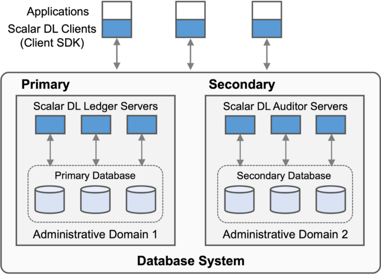

# Scalar DL Implementation

Scalar DL is scalable and practical Byzantine fault detection middleware for transactional database systems, which achieves correctness, scalability, and database agnosticism.
This document briefly introduces the implementation of Scalar DL.
For the architecture, novelty and Byzantine fault detection protocol of Scalar DL, please see the [design document](design.md).

## Scalar DL components

Scalar DL is middleware that runs on top of databases and is mainly written in Java. Scalar DL is composed of Ledger, Auditor, and Client SDK. Let's look at each component.

### Ledger

Ledger implements the commit phase of the byzantine fault detection protocol. Ledger also manages programmable deterministic functions called Contracts for users to create one-shot transactions. In a Contract, users can write arbitrary business logic and call database operations through the interface defined by the Contract. Nested invocation, i.e., a Contract calling another Contract, is supported so that users can implement an application's business logic with multiple Contracts modularly. Ledger executes multiple Contracts in an ACID manner by exploiting the underlying database transaction. Each Contract is stored in the database in a Java bytecode format with a digital signature attached for later verification.

Ledger abstracts the underlying database as a multi-dimensional map based on the key-value data model, which is similar to the data model of Bigtable. We chose the abstraction to achieve broad applicability for various databases and data models. A record is composed of a record key (application-level primary key), a version, and a set of values, including a Contract argument used to derive the record, and a cryptographic hash of all the record values. A record key and a version form a primary key, and the primary key uniquely maps a set of values. Ledger manages the versions of records for achieving traceability. Ledger also constructs a hash-chain for the records that have the same record key to make the records difficult to be maliciously altered partially, but Scalar DL does not need the hash-chain structure to provide Byzantine fault detection capability.

Ledger implements the detection protocol using the database abstraction to achieve database-agnostic property. We use Scalar DB, a universal transaction manager, to implement the database abstraction efficiently. The database abstraction currently supports PostgreSQL, MySQL, Oracle Database, Microsoft SQL Server, Apache Cassandra, Amazon DynamoDB, Amazon Aurora, Azure Cosmos DB, and their compatible databases. For those non-ACID databases such as Cassandra, HBase, DynamoDB, and Cosmos DB, Scalar DB takes care of transactions with its database-agnostic ACID transaction capability that supports snapshot isolation and strict serializability. For those ACID databases, Scalar DB provides two options: delegating transaction management to the underlying databases or doing transaction management by itself.

Ledger by only itself can provide the service to users. In such a case, Scalar DL works similarly to Oracle Blockchain Table or Amazon QLDB except for the database-agnostic transaction capability, i.e., it manages a database in a single administrative domain (AD), so it only detects some limited class of Byzantine faults.

### Auditor

Auditor implements the ordering and validation phases of the Byzantine fault detection protocol. Auditor also manages the same Contracts as Ledger and uses the same database abstraction as Ledger so that Auditor can use various databases as the underlying database.
Auditor has to be placed in a different administrative domain from the one where Ledger is placed to guarantee correctness.

### Client SDK

Client SDK interacts with Ledger and Auditor on the basis of the protocol. An application program integrated with Client SDK manages a key pair (i.e., a private key and a certificate) for digital signature and creates a digitally-signed execution request to be authenticated to execute Contracts. The digitally-signed request is also stored in the databases so that the request can identify who has executed the request, which adds extra security and traceability to the system. Client SDK can also use HMAC authentication by sharing a secret between the client and servers; however, an HMAC-signature added request cannot provide such non-repudiation.
Client SDKs are written in several languages: Java, Node.js, in-browser JavaScript, and Go.

## Further reading

* [Scalar DL Design Document](design.md)